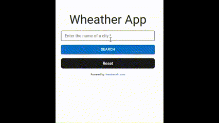

# Wheather App

Esta es una aplicación web de clima que te permite buscar el clima actual de cualquier ciudad. La aplicación consume el API de WeatherAPI.com para obtener datos meteorológicos en tiempo real.



## Características

- Buscar el clima actual de cualquier ciudad.
- Mostrar la temperatura, condiciones climáticas y un icono correspondiente.
- Validación de formulario y manejo de errores.
- Indicador de carga al buscar el clima.
- Botón de reinicio para restablecer el formulario.

## Tecnologías utilizadas

- Yarn: Manejador de paquetes para JavaScript y TypeScript.
- Vite: Herramienta de construcción y desarrollo rápida para aplicaciones web.
- React: Biblioteca para construir interfaces de usuario.
- Material-UI: Componentes de interfaz de usuario para React.

## Instrucciones de uso

1. Clona este repositorio en tu máquina local.
2. Instala las dependencias usando Yarn.

```bash
yarn
```

3. Obten una clave de API de WeatherAPI.com siguiendo las instrucciones en https://www.weatherapi.com/. Copia tu clave de API.

4. Crea un archivo .env en la raíz del proyecto y agrega la siguiente variable con tu clave de API:
   <span>VITE_API_KEY=YOUR_API_KEY_HERE
   </span>
5. Inicia la aplicación.

```bash
yarn dev
```

La aplicación se ejecutará en `http://localhost:3000`.

## Contribución

¡Gracias por considerar contribuir a Weather App! Si tienes alguna sugerencia, problema o mejora, siéntete libre de abrir un problema o enviar una solicitud de extracción.
